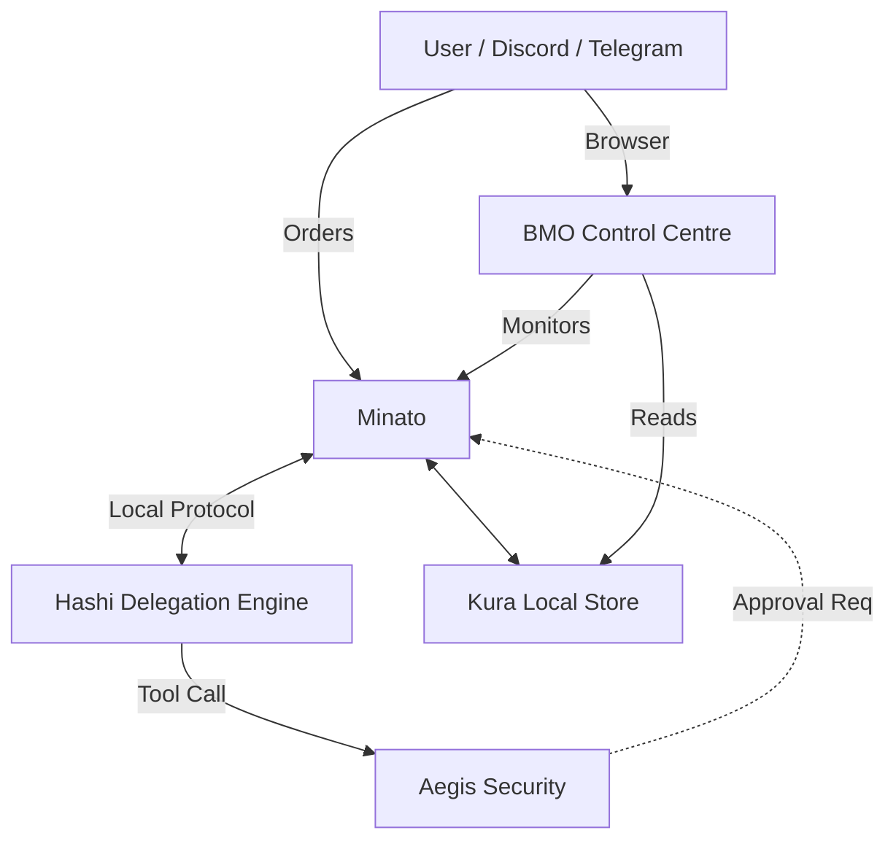

# Project Minato (The Agent Orchestrator) ⚓

## Overview
Project Minato is the central **Orchestration and Communication Hub**. It lives on the **Client Side** (e.g., your laptop or local server) and acts as the bridge between user channels and technical delegation engines.

## Key Features
- **Central Orchestration:** Receives orders from User Channels and routes them locally.
- **Unified Channel Layer:** Only component responsible for external messaging (Discord, Telegram, Web UI).
- **Session Coordination:** Manages real-time data streaming.
- **Local-First Storage:** Integrated with **Project Kura** for local-first persistent state.

## Architecture
Minato sits on the user's machine, coordinating local workers like Hashi.

## BMO Control Centre (Web Dashboard)

The **BMO Control Centre** is the visual monitoring layer for the Minato ecosystem. It provides a real-time web dashboard showing system health, agent activity, cron jobs, knowledge base status, and vault sync — all the operational data that Minato coordinates.

**Standalone repo:** [kagi-labs/bmo_control_centre](https://github.com/kagi-labs/bmo_control_centre)

**Stack:** Go + htmx + Tailwind CSS (single binary, Pi-friendly)

**Integration with Minato:**
- Reads the same data sources that Minato orchestrates (cron jobs, agent sessions, KB vectors, sync logs)
- Could evolve into Minato's native web UI, providing browser-based access alongside Discord/Telegram channels
- Future: expose Minato session control (start/stop agents, trigger syncs, manage cron) via the dashboard
