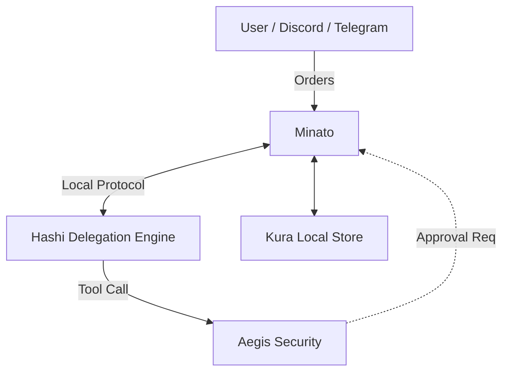

# Project Minato (The Agent Orchestrator) ⚓

## Overview
Project Minato is the central **Orchestration and Communication Hub**. It lives on the **Client Side** (e.g., your laptop or local server) and acts as the bridge between user channels and technical delegation engines.

## Key Features
- **Central Orchestration:** Receives orders from User Channels and routes them locally.
- **Unified Channel Layer:** Only component responsible for external messaging (Discord, Telegram, Web UI).
- **Session Coordination:** Manages real-time data streaming.
- **Local-First Storage:** Integrated with **Project Kura** for local-first persistent state.

## Architecture
Minato sits on the user's machine, coordinating local workers like Hashi.

