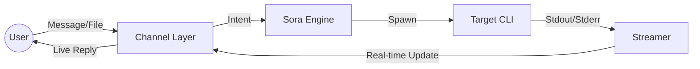

# Sora-Link Architecture

## The Loop

## 1. Channel Layer (`internal/channel`)
Instead of relying on external plugins, we build specific handlers:
- **Telegram:** Long-polling or Webhook receiver.
- **Vault-Watch:** Inotify-based watcher for the Obsidian Vault.

## 2. Sora Engine (`internal/engine`)
The core logic for mapping inputs to commands.
- **Command Selection:** Detects if the user wants `claude`, `gh`, or a custom script.
- **Environment Setup:** Prepares PATH and secrets for the session.

## 3. Streamer (`internal/stream`)
The "Live" component.
- Uses `io.Pipe` or similar to capture CLI output.
- Batches chunks (to avoid rate limits) and sends "typing" or message edits to the channel to simulate a stream.

## 4. Security
- Every command must be verified against the **MCP Firewall** before execution.
\n## Review Needed
