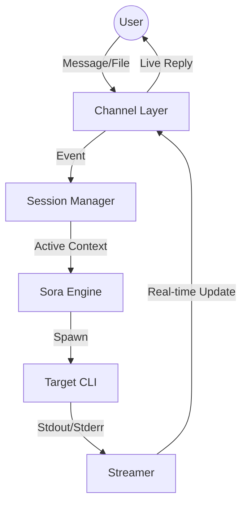

# Sora-Link Architecture

## The Loop


## 1. Channel Layer (`internal/channel`)
Instead of relying on external plugins, we build specific handlers:
- **Telegram:** Supports a single stream of conversation. Commands like `/switch <id>` or special prefixes allow the user to toggle which session the current chat is "listening" to.
- **Vault-Watch:** Monitors a root `Sessions/` folder. Dropping a file into `Sessions/ProjectA/input.txt` automatically routes the message to the \"ProjectA\" session.

## 2. Session Manager (`internal/session`)
The brain that keeps track of multiple concurrent tasks.
- **Context Tracking:** Maps a Channel ID (e.g., Telegram Chat ID) to an Active Session ID.
- **Persistence:** Each session has a dedicated directory in the Vault:
  ```
  Vault/Sora/Sessions/
  ├── session-alpha/
  │   ├── input.log
  │   ├── output.log
  │   └── artifacts/
  └── session-beta/
  ```
- **Switching:** When a user switches context, the Manager updates the mapping and notifies the Streamer to route subsequent output to the new target.

## 3. Sora Engine (`internal/engine`)
The core logic for mapping inputs to commands.
- **Command Selection:** Detects if the user wants `claude`, `gh`, or a custom script.
- **Environment Setup:** Prepares PATH and secrets for the session.

## 4. Streamer (`internal/stream`)
The \"Live\" component.
- Uses `io.Pipe` or similar to capture CLI output.
- **Multiplexing:** Can handle multiple streams simultaneously, but routes the \"active\" stream to the UI (Telegram) based on the Session Manager's current context.

## 5. Security
- Every command must be verified against the **MCP Firewall** before execution.
