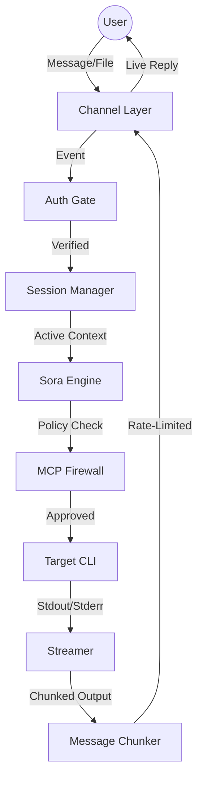

# Minato Architecture

## Overview

Sora-Link ("Sky Link") is a standalone remote CLI orchestrator written in Go. It provides
real-time, bidirectional access to CLI tools on the host machine via external channels
(Telegram, filesystem). It enables a user to execute commands from anywhere, see output
streamed live, and manage multiple concurrent sessions.

**Core Principles:**
- The user sends a message via Telegram. Sora-Link executes it on the host. Output streams back live.
- Multiple sessions can run concurrently. The user switches context to follow different tasks.
- All command execution is gated through the MCP Firewall for safety.
- Session state persists to the Vault (filesystem) for inspection and continuity.

**Integration Points:**
- **MCP Firewall:** Every command Sora-Link executes is wrapped through `mcp-firewall run --`
  before spawning. The firewall's policy engine and approval flow apply. If the firewall's
  approval adapter is set to Telegram, approval prompts appear in the same chat as the
  command output, creating a seamless experience.
- **Hashi:** When Hashi runs in headless mode, it routes notifications to Sora-Link's Channel
  Layer via a Unix socket. Sora-Link delivers these to the user's Telegram chat. Hashi can
  also be invoked as a CLI tool from within a Sora-Link session (`/run hashi <task>`).

## The Loop



<<<<<<< HEAD
**Detailed Flow:**
1. User sends a message or file to the Telegram bot (or drops a file into a Vault session folder).
2. The Channel Layer receives the event and passes it to the Auth Gate.
3. The Auth Gate verifies the sender is authorized (Telegram user ID allowlist).
4. The Session Manager resolves the active session for this channel and prepares the execution context.
5. The Sora Engine parses the command, resolves the target CLI, and prepares the environment.
6. The command is dispatched through the MCP Firewall for policy evaluation and approval.
7. On approval, the CLI process is spawned. Its stdout and stderr are captured by the Streamer.
8. The Streamer sends output in real-time to the Message Chunker.
9. The Message Chunker respects Telegram API limits and delivers formatted output to the Channel Layer.
10. The Channel Layer sends the output as Telegram messages to the user.

## Directory Structure

```
/
├── cmd/
│   └── sora-link/
│       └── main.go                 # Entry point, signal handling, graceful shutdown
├── internal/
│   ├── channel/                    # Channel implementations
│   │   ├── channel.go              # Channel interface
│   │   ├── telegram.go             # Telegram Bot API handler
│   │   ├── telegram_ratelimit.go   # Telegram rate limiter
│   │   ├── vault.go                # Filesystem/Vault watcher channel
│   │   └── chunker.go              # Message chunking for platform limits
│   ├── auth/                       # Authentication and authorization
│   │   └── gate.go                 # User allowlist, rate limiting
│   ├── session/                    # Session management
│   │   ├── manager.go              # Session lifecycle and context switching
│   │   ├── session.go              # Session state and metadata
│   │   └── store.go                # Filesystem persistence (Vault)
│   ├── engine/                     # Command execution engine
│   │   ├── engine.go               # Command parsing, validation, dispatching
│   │   ├── process.go              # Process lifecycle management (spawn, monitor, kill)
│   │   └── env.go                  # Environment preparation (PATH, secrets, cwd)
│   ├── stream/                     # Output streaming
│   │   ├── streamer.go             # io.Pipe-based output capture with backpressure
│   │   ├── multiplexer.go          # Multi-session stream routing
│   │   └── buffer.go               # Ring buffer for scrollback
│   └── firewall/                   # MCP Firewall integration
│       └── client.go               # Firewall wrapper invocation
├── configs/
│   └── sora-link.yaml              # Default configuration
├── docs/
│   └── ARCHITECTURE.md
└── tests/
    ├── integration/
    └── fixtures/
```

## Core Components

### 1. Channel Layer (`internal/channel`)

The Channel Layer abstracts the communication medium between the user and Sora-Link.

**Channel Interface:**
```go
type Channel interface {
    // Start begins listening for incoming messages. Blocking.
    Start(ctx context.Context) error
    // Send delivers a message to the channel.
    Send(ctx context.Context, msg OutgoingMessage) error
    // Receive returns a channel of incoming messages.
    Receive() <-chan IncomingMessage
}

type IncomingMessage struct {
    ChannelID   string          // e.g., Telegram chat ID
    SenderID    string          // e.g., Telegram user ID
    Text        string          // Message text (command)
    File        *FileAttachment // Optional file attachment
    Timestamp   time.Time
}

type OutgoingMessage struct {
    ChannelID   string
    Text        string
    ParseMode   string          // "Markdown" | "HTML" | ""
    ReplyToID   string          // Optional: reply to specific message
}
```

**Telegram Channel:**
- Uses the Telegram Bot API via long polling (`getUpdates`).
- Handles commands: `/start`, `/switch <session>`, `/list`, `/kill`, `/status`, `/help`.
- Supports file uploads: files sent to the bot are saved to the active session's `artifacts/` directory.
- Supports inline keyboard menus for session switching and command shortcuts.

**Telegram Rate Limiting:**

Telegram enforces strict rate limits that Sora-Link must respect:

| Limit | Value | Sora-Link Handling |
|---|---|---|
| Messages to same chat | 20/minute (1 per 3 seconds) | Token bucket rate limiter with 3-second minimum interval |
| Messages to different chats | 30/second | Global rate limiter (unlikely to hit with single-user use) |
| Message length | 4096 characters | Message Chunker splits output |
| Caption length | 1024 characters | Truncate with "[truncated]" suffix |
| File size | 50 MB upload, 20 MB download | Reject oversized files with error message |
| Editing messages | Same limits as sending | Sora-Link edits the last message for streaming updates |

**Streaming Strategy (Telegram):**
- For short-lived commands (<5 seconds), wait for completion and send final output.
- For long-running commands, Sora-Link sends an initial "Running..." message and **edits** it
  with updated output every 3 seconds (respecting rate limits).
- If output exceeds 4096 characters, a new message is sent for the next chunk. The previous
  message is finalized with "[continued below]".
- After the command completes, the final message includes execution time and exit code.

**Message Chunker (`internal/channel/chunker.go`):**
- Splits output at line boundaries (never mid-line) to preserve readability.
- Wraps output in triple-backtick code blocks for monospace rendering.
- Accounts for code block delimiters and metadata in the 4096-character budget.
- If a single line exceeds 4000 characters, it is truncated with "...[truncated]".

**Vault-Watch Channel:**
- Monitors `Vault/Sora/Sessions/` using `fsnotify`.
- A file written to `Sessions/<name>/input.txt` triggers the Engine with the file contents as input.
- Output is written to `Sessions/<name>/output.txt`.
- **Debouncing:** File events are debounced with a 500ms window to handle partial writes.
- **File Locking:** Uses advisory file locks (`flock`) to prevent reading a file while it is
  being written by an external process (e.g., Rclone sync).

### 2. Authentication Gate (`internal/auth`)

**Responsibility:** Verify that incoming messages are from authorized users before processing.

**Implementation:**
- Telegram user IDs are checked against an allowlist in `sora-link.yaml`.
- Unauthorized messages receive no response (silent drop) to avoid revealing the bot's existence.
- Rate limiting: max 10 commands per minute per user. Excess commands are queued, not dropped,
  with a "throttled" notification sent to the user.

**Configuration:**
```yaml
auth:
  allowed_users:
    - 123456789           # Telegram user ID
  rate_limit:
    commands_per_minute: 10
    burst: 3              # Allow bursts of up to 3 rapid commands
```

### 3. Session Manager (`internal/session`)

**Responsibility:** Manage multiple concurrent CLI sessions with context switching.

**Session State:**
```go
type Session struct {
    ID          string
    Name        string          // Human-readable name
    Status      SessionStatus   // active | idle | dead
    CreatedAt   time.Time
    LastActive  time.Time
    Process     *os.Process     // Running CLI process (nil if idle)
    WorkDir     string          // Working directory for the session
    Env         map[string]string
}

type SessionStatus int
const (
    SessionActive SessionStatus = iota  // Process is running
    SessionIdle                         // No process running, session exists
    SessionDead                         // Process exited, session archived
)
```

**Context Tracking:**
- Maps Channel ID (Telegram chat ID) to Active Session ID.
- A channel can have only one active session at a time, but multiple sessions can exist concurrently.
- `/switch <session>` updates the mapping and redirects the Streamer output.

**Session Lifecycle:**
1. **Creation:** A new session is created when the user sends a command and no session exists,
   or when they explicitly create one (`/new <name>`).
2. **Active:** A CLI process is running. Output streams to the channel.
3. **Idle:** The process has exited. The session's history is preserved. The user can reactivate
   it by switching to it and running a new command.
4. **Dead:** The session is archived. Its directory remains in the Vault for inspection but is
   no longer selectable.

**Persistence (Vault):**
```
Vault/Sora/Sessions/
├── project-alpha/
│   ├── session.json        # Session metadata (ID, name, status, created, env)
│   ├── input.log           # All commands sent to this session (append-only)
│   ├── output.log          # All output from this session (append-only)
│   ├── artifacts/          # Files uploaded or generated by the session
│   └── .pid                # PID of the running process (if active)
└── project-beta/
    ├── session.json
    ├── input.log
    ├── output.log
    └── artifacts/
```

**Concurrency and Race Conditions:**
- Session state is protected by a `sync.RWMutex` per session.
- The channel-to-session mapping is protected by a global `sync.RWMutex`.
- **Race: Two messages arrive simultaneously for different sessions.** Each message is processed
  in its own goroutine. The mutex ensures the mapping read is consistent. Both sessions execute
  their commands independently.
- **Race: `/switch` arrives while a command is executing.** The switch updates the mapping
  immediately. The Streamer starts routing new output to the new session's channel. The old
  session's command continues running; its output is still logged to disk but no longer streamed
  to Telegram (unless the user switches back).
- **Race: `/kill` arrives while a command is executing.** The kill handler sends SIGTERM to the
  process group, waits 5 seconds, then SIGKILL. The session transitions to `dead`.

### 4. Sora Engine (`internal/engine`)

**Responsibility:** Parse commands, resolve target CLIs, prepare execution environments, and
manage process lifecycles.

**Command Parsing:**

User input is parsed into a structured command:
- `/run <command> [args...]`: Execute a shell command in the active session.
- `/claude <prompt>`: Shortcut for `claude --print "<prompt>"` (Claude Code CLI).
- `/gh <subcommand>`: Shortcut for GitHub CLI.
- `/script <name>`: Execute a named script from `~/.sora-link/scripts/`.
- Raw text (no `/` prefix): Treated as `/run <text>` by default.

**Command Validation:**
- Commands are validated against a configurable allowlist of permitted binaries.
- Path traversal in arguments is detected and blocked (e.g., `../../etc/passwd`).
- Maximum argument length: 8192 characters. Longer inputs are rejected.

**Environment Preparation:**
- Each session has an isolated environment built from:
  1. Base system PATH.
  2. Hashi's tool directory (`~/.hashi/bin/`) if Hashi is installed.
  3. Session-specific environment variables from `session.json`.
  4. Secrets injected via environment variables (resolved from the secret provider).
- The working directory is set to the session's `WorkDir` (configurable per session).

**Process Management (`internal/engine/process.go`):**

```go
type ProcessManager struct {
    cmd       *exec.Cmd
    stdin     io.WriteCloser
    stdout    io.ReadCloser
    stderr    io.ReadCloser
    done      chan struct{}
    exitCode  int
    err       error
}
```

- Processes are spawned in their own process group (`Setpgid: true`) to enable group-level signal delivery.
- **Timeout:** Each command has a configurable timeout (default: 10 minutes). On timeout:
  1. Send SIGTERM to the process group.
  2. Wait 5 seconds.
  3. Send SIGKILL if still running.
  4. Notify the user: "Command timed out after 10m."
- **Zombie Prevention:** The Engine runs a reaper goroutine that calls `Wait()` on all child
  processes. If a process exits without being waited, the reaper collects it within 1 second.
- **OOM / Crash Detection:** If the process exits with signal 9 (SIGKILL, likely OOM) or a
  non-zero exit code, the Engine includes the exit signal and last 20 lines of stderr in the
  notification to the user.
- **Interactive Processes:** Some CLIs (like `claude`) expect stdin input. Sora-Link supports
  piping the next Telegram message as stdin to the running process. The user sends a message
  while a command is active, and it is written to the process's stdin.

### 5. Streamer (`internal/stream`)

**Responsibility:** Capture CLI output in real-time and route it to the appropriate channel.

**Implementation:**
- Uses `io.Pipe` connected to the process's stdout and stderr (merged into a single stream
  with `[stderr]` prefix for stderr lines).
- A reader goroutine consumes the pipe and writes to:
  1. The session's `output.log` file (always, regardless of which session is "active" in the channel).
  2. The active channel (Telegram) via the Message Chunker (only if this session is the currently
     active session for the channel).

**Backpressure:**
- The Streamer uses a ring buffer (default: 64KB) between the pipe reader and the channel sender.
- If the channel sender cannot keep up (Telegram rate limits), the ring buffer absorbs bursts.
- If the ring buffer is full, the oldest content is overwritten (the user may miss intermediate
  output, but the final state is always delivered). A "[output truncated due to rate limits]"
  message is inserted.
- The `output.log` file always receives the complete, untruncated output.

**Multiplexer:**
- The multiplexer tracks all active streams (one per running session).
- When the user switches sessions (`/switch`), the multiplexer:
  1. Stops routing the old session's stream to the channel.
  2. Sends the last 20 lines of the new session's ring buffer as "context" to the channel.
  3. Begins routing the new session's stream to the channel.

**Scrollback:**
- The ring buffer enables a `/scrollback [n]` command that retrieves the last `n` lines of
  output from the current session without re-executing the command.

### 6. MCP Firewall Integration (`internal/firewall`)

**Responsibility:** Wrap every command execution through the MCP Firewall.

**Implementation:**
- Before spawning a CLI process, the Engine prepends `mcp-firewall run --` to the command.
- The firewall config path is provided via `sora-link.yaml`.
- If the firewall binary is not found or not configured, Sora-Link refuses to execute commands
  and notifies the user: "MCP Firewall not configured. Command execution disabled for safety."

**Approval Flow Integration:**
- When the firewall's approval adapter is Telegram, approval prompts appear in the same chat.
- The user approves or denies inline, and the command proceeds or is blocked.
- If the approval adapter is `terminal`, Sora-Link cannot provide approval (there is no
  terminal). The configuration guide warns against this combination.

## Configuration

```yaml
# configs/sora-link.yaml
version: "1"

channel:
  telegram:
    enabled: true
    bot_token: ${SORA_LINK_TELEGRAM_BOT_TOKEN}
    polling_timeout: 30          # Long polling timeout in seconds
    streaming_edit_interval: 3s  # How often to edit the "streaming" message
    max_message_length: 4096
  vault:
    enabled: true
    watch_path: ~/Vault/Sora/Sessions
    debounce_ms: 500

auth:
  allowed_users:
    - 123456789
  rate_limit:
    commands_per_minute: 10
    burst: 3

session:
  vault_path: ~/Vault/Sora/Sessions
  default_workdir: ~
  max_concurrent_sessions: 10
  session_idle_timeout: 24h     # Archive idle sessions after 24 hours

engine:
  command_timeout: 10m
  max_argument_length: 8192
  allowed_commands:
    - claude
    - gh
    - git
    - ls
    - cat
    - python3
    - node
    - npm
    - npx
    - hashi
  scripts_dir: ~/.sora-link/scripts

stream:
  ring_buffer_size: 65536       # 64KB ring buffer per session
  scrollback_default_lines: 50

firewall:
  enabled: true
  binary: mcp-firewall
  config: ~/.mcp-firewall/firewall.yaml

logging:
  level: info
  file: ~/.sora-link/sora-link.log
  max_size_mb: 50
  max_backups: 3
```

## Telegram Commands Reference

| Command | Description |
|---|---|
| `/start` | Initialize the bot, show welcome message |
| `/help` | Show available commands |
| `/run <cmd>` | Execute a command in the active session |
| `/claude <prompt>` | Shortcut for Claude Code CLI |
| `/gh <subcommand>` | Shortcut for GitHub CLI |
| `/script <name>` | Execute a named script |
| `/new <name>` | Create a new session |
| `/switch <name>` | Switch to an existing session |
| `/list` | List all sessions with status |
| `/status` | Show active session details (PID, uptime, last command) |
| `/kill` | Kill the running process in the active session |
| `/kill <name>` | Kill a specific session's process |
| `/scrollback [n]` | Show last n lines of output (default: 50) |
| `/env KEY=VALUE` | Set an environment variable for the active session |
| `/cwd <path>` | Change the working directory for the active session |

## Error Handling Summary

| Scenario | Behavior |
|---|---|
| Unauthorized Telegram user | Silent drop, no response |
| Rate limit exceeded | Queue command, send "throttled" notification |
| Command not in allowlist | Reject with error message |
| MCP Firewall not configured | Refuse all commands, notify user |
| MCP Firewall denies command | Notify user: "Command blocked by firewall policy" |
| CLI process crashes (non-zero exit) | Send exit code + last 20 lines of stderr to user |
| CLI process hangs (timeout) | SIGTERM, wait 5s, SIGKILL, notify user |
| CLI process killed by OOM | Detect SIGKILL, notify user with explanation |
| Telegram API unreachable | Retry with exponential backoff (1s, 2s, 4s), max 5 attempts |
| Telegram rate limit (429) | Respect `Retry-After` header, queue messages |
| Message exceeds 4096 chars | Chunk at line boundaries, send multiple messages |
| File exceeds 50 MB | Reject with error message |
| Session directory missing | Recreate directory structure, log warning |
| Vault-Watch file lock contention | Retry read after 200ms, max 3 attempts |
| Multiple commands sent rapidly | Queue and execute sequentially per session |
| `/switch` during active command | Update routing immediately, old command continues in background |
| `/kill` during active command | SIGTERM to process group, SIGKILL after 5s |
| Sora-Link shutdown (SIGTERM) | SIGTERM all child processes, wait 10s, SIGKILL stragglers, flush logs |

## Graceful Shutdown

Sora-Link listens for `SIGINT` and `SIGTERM`:
1. Stop accepting new Telegram updates (stop long polling).
2. Send "Sora-Link is shutting down" to all active channels.
3. Send SIGTERM to all running child processes (via process group).
4. Wait up to 10 seconds for processes to exit.
5. SIGKILL any remaining processes.
6. Flush all output logs.
7. Update all active session statuses to `dead` in their `session.json`.
8. Close filesystem watchers.
9. Exit cleanly.

## Security Considerations

- **No shell expansion:** Commands are executed via `exec.Command` (direct exec), not via
  `sh -c`. Shell metacharacters (`|`, `;`, `&&`, `` ` ``) are not interpreted. If the user
  needs shell features, they must explicitly use `/run sh -c "..."`.
- **Allowlist enforcement:** Only binaries in the `allowed_commands` list can be executed.
  This is enforced before the MCP Firewall check (defense in depth).
- **Secret isolation:** Secrets are injected as environment variables, not logged, and not
  included in Telegram messages. The output streamer redacts known secret patterns.
- **Process isolation:** Each process runs in its own process group. A runaway process cannot
  affect Sora-Link's main process.
- **Telegram bot token protection:** The bot token is loaded from an environment variable,
  never stored in plaintext config files.
