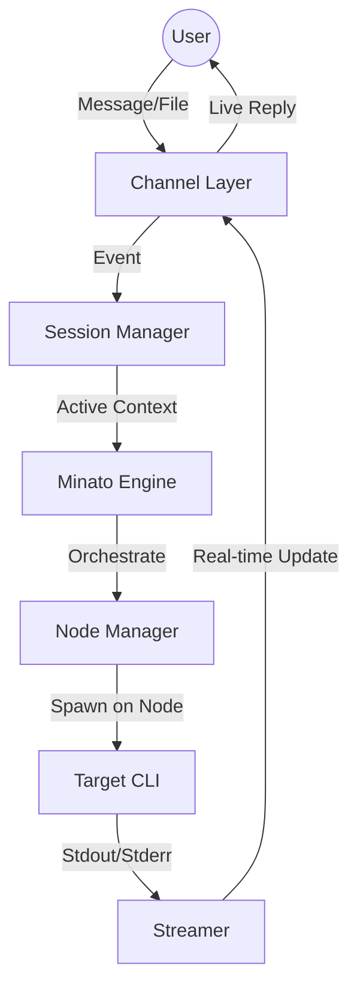

# Minato Architecture

## The Loop


## 1. Channel Layer (`internal/channel`)
Instead of relying on external plugins, we build specific handlers:
- **Telegram:** Supports a single stream of conversation. Commands like `/switch <id>` or special prefixes allow the user to toggle which session the current chat is "listening" to.
- **Vault-Watch:** Monitors a root `Sessions/` folder. Dropping a file into `Sessions/ProjectA/input.txt` automatically routes the message to the "ProjectA" session.

## 2. Session Manager (`internal/session`)
The brain that keeps track of multiple concurrent tasks.
- **Context Tracking:** Maps a Channel ID (e.g., Telegram Chat ID) to an Active Session ID.
- **Persistence:** Each session has a dedicated directory in the Vault:
  ```
  Vault/Minato/Sessions/
  ├── session-alpha/
  │   ├── input.log
  │   ├── output.log
  │   └── artifacts/
  └── session-beta/
  ```
- **Switching:** When a user switches context, the Manager updates the mapping and notifies the Streamer to route subsequent output to the new target.

## 3. Node Manager (`internal/nodes`)
The orchestration layer for the Harbor Cluster and external compute.
- **Multi-Backend Support:**
    - **Local OpenClaw Nodes:** Native pairing via OpenClaw's P2P protocol.
    - **Kubernetes (K8s) Cluster:** Listener for a K8s controller to monitor and stream logs/results from pods/jobs.
- **Status Monitoring:** Tracks CPU/RAM and container health across all backends.
- **Workload Distribution:** Selects the optimal execution target based on requirements (e.g., lightweight scripts on a Pi node, heavy training/browsing on K8s).

## 4. Minato Engine (`internal/engine`)
The core logic for mapping inputs to commands and session tracking.
- **Session Types:**
    - **Multiplexers:** Native tracking of `tmux` or `zellij` sessions.
    - **Agent-Runs:** Internal implementation for isolated sub-agent execution.
    - **K8s Pods:** Direct log streaming from remote containers.
- **Command Selection:** Detects if the user wants `claude`, `gh`, or a specific infrastructure command.
- **Environment Setup:** Prepares PATH, secrets, and context for the session.

## 5. Streamer (`internal/stream`)
The "Live" component.
- Uses `io.Pipe` or similar to capture CLI output.
- **Multiplexing:** Can handle multiple streams simultaneously, but routes the "active" stream to the UI (Telegram) based on the Session Manager's current context.

## 6. Security
- Every command must be verified against the **MCP Firewall** before execution.

